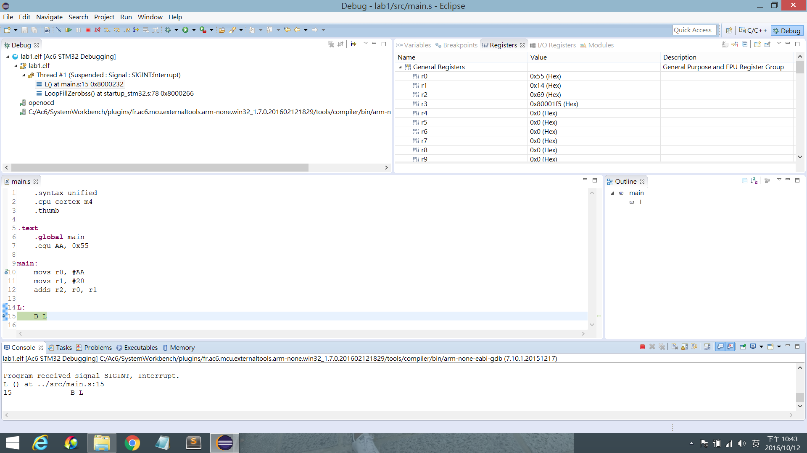
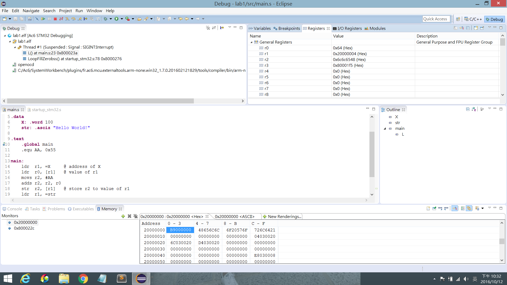
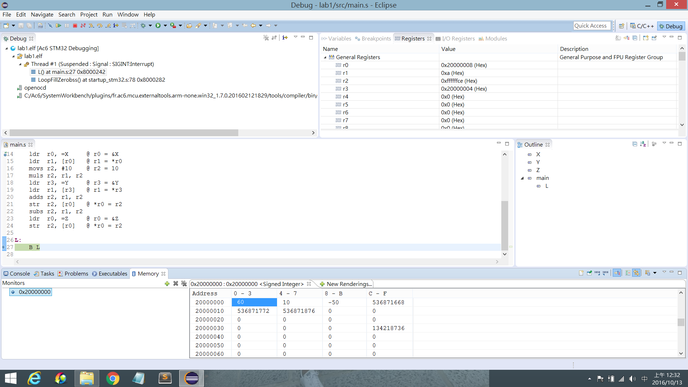

# 實驗一 實驗結報 #

## 實驗名稱 ##

實驗環境建立與 Debugger 操作

## 實驗目的 ##

* 測試實驗器材。
* 熟悉開發環境。

## 實驗步驟 ##

### 專案建立與程式編譯 ###

```assembly
01     .syntax unified
02     .cpu cortex-m4
03     .thumb
04
05 .text
06     .global main
07     .equ AA, 0x55
08
09 main:
10     movs r0, #AA
11     movs r1, #20
12     adds r2, r0, r1
13
14 L:
15     B L
```

### 變數宣告與記憶體觀察 ###

```assembly
01     .syntax unified
02     .cpu cortex-m4
03     .thumb
04
05 .data
06     X: .word 100
07     str: .asciz "Hello World!"
08
09 .text
10     .global main
11     .equ AA, 0x55
12
13 main:
14     ldr  r1, =X     @ address of X
15     ldr  r0, [r1]   @ value of r1
16     movs r2, #AA
17     adds r2, r2, r0
18     str  r2, [r1]   @ store r2 to value of r1
19     ldr  r1, =str
20     ldr  r2, [r1]   @ "Hell" only
21
22 L:
23     B L
```

### 簡易算數與基本記憶體指令操作 ###

```assembly
01     .syntax unified
02     .cpu cortex-m4
03     .thumb
04
05 .data
06     X: .word 5
07     Y: .word 10
08     Z: .word
09
10 .text
11     .global main
12
13 main:
14     ldr  r0, =X     @ r0 = &X
15     ldr  r1, [r0]   @ r1 = *r0
16     movs r2, #10    @ r2 = 10
17     muls r2, r1, r2
18     ldr  r3, =Y     @ r3 = &Y
19     ldr  r1, [r3]   @ r1 = *r3
20     adds r2, r1, r2
21     str  r2, [r0]   @ *r0 = r2
22     subs r2, r1, r2
23     ldr  r0, =Z     @ r0 = &Z
24     str  r2, [r0]   @ *r0 = r2
25
25 L:
27     B L
```

## 實驗結果與問題回答 ##

### 專案建立與程式編譯 ###



1. 程式執行結束後 `r2` 值為多少？如何觀察？  
   值為多少：`0x69`。  
   如何觀察：進入 debug 模式，讓程式執行到最後，用眼睛看右上角的 "Registers" 視窗。

### 變數宣告與記憶體觀察 ###



觀察 `X` 內容值變化：  
初始值為 `0x64 (=100)`，第 18 行執行後變為 `0xb9`。

1. 變數 `X` 與 `str` 的初始值是由誰在何處初始化的？  
   由誰：微控制器啟動（或 reset）時執行的程式。  
   在何處：`startup_stm32.s` 中的 `LoopCopyDataInit` 與 `CopyDataInit` 標籤。

2. 若將 `X` 宣告改在 text section 對其程式執行結果會有何改變？  
   `X` 的位址會改變（從 data section 移至 text section）。  
   `str` 的位址會改變（往前移四個位元組）。  
   因為 text section 是唯讀的，所以第 18 行（將值寫入 `X` 的位址）無效。

3. 程式執行完畢後 `r2` 內容與 `str` 字串在 memory 前 4 個 byte 呈現內容有何差異？  
   `r2` 的值是 `0x6c6c6548`，也就是 "lleH"。  
   `str` 的前四個位元組是 `0x48656c6c`，也就是 "Hell"。  
   （所以這個微控制器是 little-endian。）

4. 變數 `str` "Hello World!" 有無其他種宣告方式？若有請說明其中一種。  
   有，因為變數的記憶體位址是連續的，所以可以將第 7 行改為：  
   ```assembly
   str:  .word 0x6c6c6548 @ "lleH"
   str1: .word 0x6f57206f @ "oW o"
   str2: .word 0x21646c72 @ "!dlr"
   str3: .byte 0x00       @ "\0"
   ```

### 簡易算數與基本記憶體指令操作 ###



找出這些變數的 memory address：  
變數 `X` 位於 `0x20000000`，其值起初為 5，最終為 60。  
變數 `Y` 位於 `0x20000004`，其值為 10。  
變數 `Z` 位於 `0x20000008`，其值最終為 -50。

## 心得討論與應用聯想 ##

* 這套開發工具雖然有 Linux 版，但是在 Ubuntu 16.04 LTS 下並不會 work。
* 原來 ARM 的組合語言的註解是用 "@" 符號。
* 指令是 case-insensitive。
