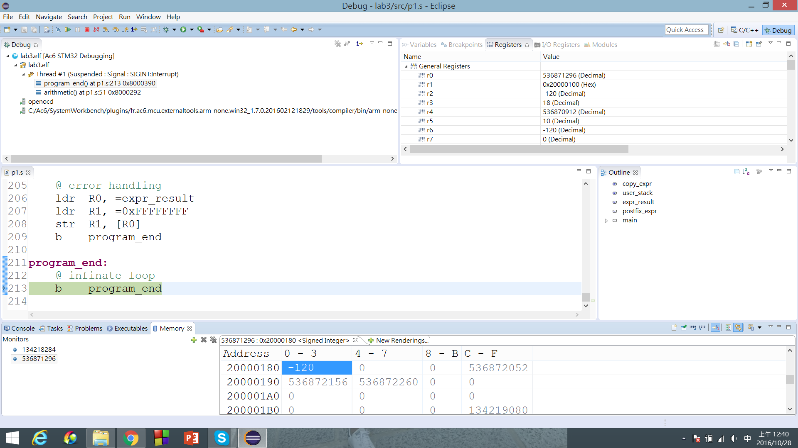
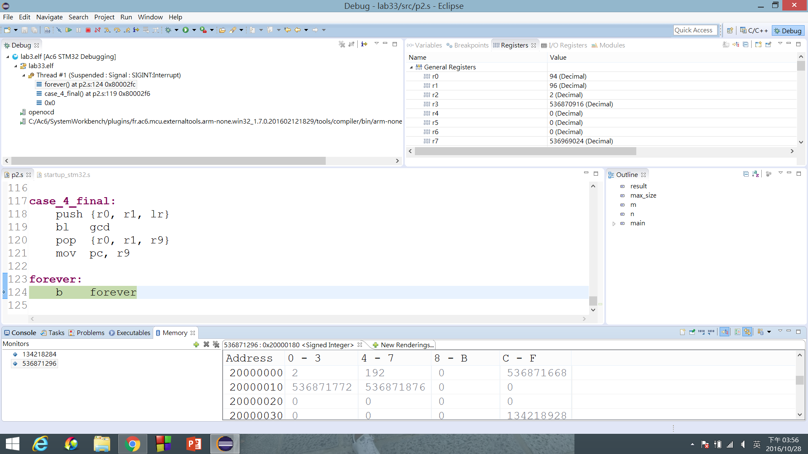

# 實驗三 實驗結報 #

0316213 蒲郁文 & 0316323 薛世恩

## 實驗名稱 ##

ARM Assembly II

## 實驗目的 ##

熟悉基本 ARMv7 組合語言語法使用

## 實驗步驟 ##

### Postfix Arithmetic ###

```assembly
	.syntax unified
	.cpu cortex-m4
	.thumb

.data
	copy_expr:   .zero 256
	user_stack:  .zero 128
	expr_result: .word 0

.text
	.global main
	postfix_expr: .asciz "-100 10 20 + - 10 +"

main:
	ldr  R0, =postfix_expr
	mov  R1, 0x0
	bl   strlen

	ldr  R0, =postfix_expr
	ldr  R1, =copy_expr
	bl   memcpy

	ldr  R0, =user_stack
	msr  msp, R0
	ldr  R2, =postfix_expr
	mov  R3, 0x0
	ldr  R4, =copy_expr
	b    arithmetic

arithmetic:
	@ arithmetic-related
	ldrb R1, [R2, R3]
	cmp  R1, 0x0
	beq  arithmetic_end
	cmp  R1, 0x20   @ '[space]'
	beq  duplicate_spaces
	ldrh R1, [R2, R3]
	ldr  R9, =0x202B
	cmp  R1, R9     @ " +"
	beq  addition
	cmp  R1, 0x2B   @ "\0+"
	beq  addition_last
	ldr  R9, =0x202D
	cmp  R1, R9     @ " -"
	beq  substraction
	cmp  R1, 0x2D   @ "\0-"
	beq  substraction_last
	add  R0, R4, R3
	mov  R5, R0
	push {R2, R3, R4, R5}
	bl   atoi
	pop  {R2, R3, R4, R5}
	push {R1}
	sub  R1, R0, R5
	add  R3, R1
	b    arithmetic

addition:
	@ arithmetic-related
	pop  {R5}
	pop  {R6}
	add  R6, R5
	push {R6}
	add  R3, 0x2
	b    arithmetic

addition_last:
	@ arithmetic-related
	pop  {R5}
	pop  {R6}
	add  R6, R5
	push {R6}
	b    arithmetic_end

substraction:
	@ arithmetic-related
	pop  {R5}
	pop  {R6}
	sub  R6, R5
	push {R6}
	add  R3, 0x2
	b    arithmetic

substraction_last:
	@ arithmetic-related
	pop  {R5}
	pop  {R6}
	sub  R6, R5
	push {R6}
	b    arithmetic_end

duplicate_spaces:
	@ arithmetic-related
	add  R3, 0x1
	b    arithmetic

arithmetic_end:
	@ arithmetic-related
	pop  {R2}
	ldr  R1, =user_stack
	mov  R9, sp
	cmp  R1, R9
	bne  error
	ldr  R0, =expr_result
	str  R2, [R0]
	b    program_end

memcpy:
	@ R0: source address
	@ R1: destination address
	push {lr}
	b    memcpy_inner

memcpy_inner:
	@ called by memcpy
	ldrb R2, [R0]
	cmp  R2, 0x0
	beq  go_back
	cmp  R2, 0x20 @ '[space]'
	it   eq
	bleq space_to_zero
	strb R2, [R1]
	add  R0, 0x1
	add  R1, 0x1
	b    memcpy_inner

space_to_zero:
	@ called by memcpy
	mov  R2, 0x0
	bx   lr

go_back:
	@ called by memcpy
	pop  {pc}

strlen:
	@ R0: start address of the string
	@ R1: string length (return)
	ldrb R2, [R0]
	cmp  R2, 0x0
	it   eq
	bxeq lr
	add  R0, 0x1
	add  R1, 0x1
	b    strlen

atoi:
	@ R0: start address of the string
	@     start address of the next token (return)
	@ R1: integer value (return)
	ldrb R1, [R0]
	mov  R2, 0x0  @ is_negative flag
	cmp  R1, 0x2B @ '+'
	beq  atoi_pos
	cmp  R1, 0x2D @ '-'
	beq  atoi_neg
	cmp  R1, 0x0
	beq  error
	mov  R1, 0x0
	b    atoi_inner

atoi_pos:
	@ called by atoi
	add  R0, 0x1
	mov  R1, 0x0
	b    atoi_inner

atoi_neg:
	@ called by atoi
	add  R0, 0x1
	mov  R1, 0x0
	mov  R2, 0x1
	b    atoi_inner

atoi_inner:
	@ called by atoi
	ldrb R3, [R0]
	cmp  R3, 0x0
	beq  atoi_end
	cmp  R3, 0x3A @ character after '9'
	bge  error
	cmp  R3, 0x2F @ character before '0'
	ble  error
	sub  R3, 0x30 @ '0'
	mov  R9, 0xA
	mul  R1, R9
	add  R1, R3
	add  R0, 0x1
	b    atoi_inner

atoi_end:
	@ called by atoi
	add  R0, 0x1
	cmp  R2, 0x0
	bne  additive_inverse
	bx   lr

additive_inverse:
	@ called by atoi
	mov  R9, 0x0
	sub  R1, R9, R1
	bx   lr

error:
	@ error handling
	ldr  R0, =expr_result
	ldr  R1, =0xFFFFFFFF
	str  R1, [R0]
	b    program_end

program_end:
	@ infinate loop
	b    program_end
```

### 求最大公因數並計算最多用了多少 Stack Size ###

```assembly
	.syntax unified
	.cpu cortex-m4
	.thumb

.data
	result:   .word 0
	max_size: .word 0

.text
	.global main
	m: .word 0x5E
	n: .word 0x60

main:
	ldr  r2, =m
	ldr  r0, [r2]
	ldr  r3, =n
	ldr  r1, [r3]

	mov  r11, sp       @ r11: start of stack
	mov  r10, 0x0      @ r10: max stack size

	push {r0, r1, lr}
	bl   gcd
	pop  {r0, r1, r9}

	ldr  r3, =result
	str  r2, [r3]

	ldr  r3, =max_size
	str  r10, [r3]

	b    forever

gcd:
	ldr  r0, [sp]      @ param a
	ldr  r1, [sp, 0x4] @ param b

	mov  r7, sp
	sub  r8, r11, r7
	cmp  r8, r10
	bgt  update_r10
	b    gcd_final

update_r10:
	mov  r10, r8

gcd_final:
	cmp  r0, 0x0
	beq  return_b

	cmp  r1, 0x0
	beq  return_a

	mov  r2, 0x1
	and  r3, r0, r2
	and  r4, r1, r2

	mov  r8, 0x1
	eor  r3, r8        @ r3: bool, a is even
	eor  r4, r8        @ r4: bool, b is even

	ands r2, r3, r4
	bne  case_1

	cmp  r3, 0x0
	bne  case_2

	cmp  r4, 0x0
	bne  case_3

	b    case_4

return_a:
	mov  r2, r0
	bx   lr

return_b:
	mov  r2, r1
	bx   lr

case_1:
	asr  r0, r0, 0x1
	asr  r1, r1, 0x1
	push {r0, r1, lr}
	bl   gcd
	pop  {r0, r1, r9}
	mov  r8, 0x2
	mul  r2, r8
	mov  pc, r9

case_2:
	asr  r0, r0, 0x1
	push {r0, r1, lr}
	bl   gcd
	pop  {r0, r1, r9}
	mov  pc, r9

case_3:
	asr  r1, r1, 0x1
	push {r0, r1, lr}
	bl   gcd
	pop  {r0, r1, r9}
	mov  pc, r9

case_4:
	cmp r0, r1
	bgt a_is_bigger
	sub r2, r1, r0     @ b - a
	mov r1, r0
	mov r0, r2
	b   case_4_final

a_is_bigger:
	sub r0, r1         @ a - b

case_4_final:
	push {r0, r1, lr}
	bl   gcd
	pop  {r0, r1, r9}
	mov  pc, r9

forever:
	b    forever
```

## 實驗結果與問題回答 ##

### Postfix Arithmetic ###



* 先執行 `strlen`，但是這個步驟其實沒有什麼意義，只不過是為了展示我們有正確地實作出 `strlen` 而已。
* 再執行 `memcpy`，將 `postfix_expr` 從唯讀的 text segment 複製到可寫入的 data segment，  
  同時將所有的空格取代為 `\0`。
* 最後執行 `arithmetic`，依照 postfix 的規則操作 stack，如果遇到運算元會先呼叫 `atoi` 將其轉換為數值。
* 錯誤處理的部份，`-100·10abc·+·-·10·+` 或 `-100·10·20·+·-·1000` 皆會判斷為錯誤，  
  `··-100··10·20··+··-·10···+·` 則能夠正確計算。（符號 `·` 表示空格。）

### 求最大公因數並計算最多用了多少 Stack Size ###



* 依照 Stein's algorithm 計算 GCD，每次呼叫函式之前，都會先將函式的兩個參數及當前的 link register 存進 stack，  
  函式回傳之後再將它們取出。
* 因此每進入一層遞迴，便會多占用 12 位元組的 stack 空間。

## 心得討論與應用聯想 ##

* 第一題的 `postfix_expr` 長度（包含 `\0`）必需是 4 的倍數，否則在 assemble 時會出現錯誤（沒有 alignment）。
* 第二題的 `max_size` 應該沒有標準答案，因為題目並沒有限制 stack 只能存放哪些資料。
* 這門課不但讓我學了微處理機，還讓我學了危機處理，雖然這門課已經改為選修了，不過我一定會推薦學弟妹來修的。
